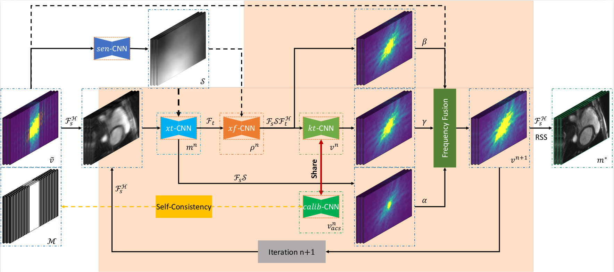

# k-t CLAIR: Self-Consistency Guided Multi-Prior Learning for Dynamic Parallel MR Image Reconstruction
[Liping Zhang](https://lpzhang.github.io), [Weitian Chen](http://www.diir.cuhk.edu.hk/profile/chen-weitian)

Lab of AI in Radiology (CLAIR), Department of Imaging and Interventional Radiology, The Chinese University of Hong Kong, Hong Kong

---

[](https://arxiv.org/abs/2310.11050)
[](https://github.com/lpzhang/ktCLAIR)
[](https://github.com/lpzhang/ktCLAIR/releases)

This repository is the official PyTorch implementation of "k-t CLAIR: Self-Consistency Guided Multi-Prior Learning for Dynamic Parallel MR Image Reconstruction" ([arxiv](https://arxiv.org/abs/2310.11050), [supp](https://github.com/lpzhang/ktCLAIR/releases), [pretrained models](https://github.com/lpzhang/ktCLAIR/releases), [visual results](https://github.com/lpzhang/ktCLAIR/releases), [oral presentation](https://www.youtube.com/watch?v=-VVPB1IN0n8)). k-t CLAIR achieves **state-of-the-art performance** in
- accelerated Cine reconstruction
- accelerated T1/T2 mapping

</br>

## Updates
- [2023/10/12] 🥉 We secured 3rd place in accelerated Cine reconstruction task in [CMRxRecon Challenge](https://www.synapse.org/#!Synapse:syn51471091/wiki/624102) during MICCAI 2023!
- [2023/10/12] 🥉 We secured 3rd place in accelerated T1/T2 Mapping task in [CMRxRecon Challenge](https://www.synapse.org/#!Synapse:syn51471091/wiki/624102) during MICCAI 2023!
- [2023/10/12] 🔥 Invited talk for CMRxRecon Challenge, [Statistical Atlases and Computational Modeling of the Heart (STACOM) Workshop](https://stacom.github.io/stacom2023/), MICCAI 2023 (Vancouver, Canada)!

## Citation
```bibtex
@misc{zhang2023kt,
      title={$k$-$t$ CLAIR: Self-Consistency Guided Multi-Prior Learning for Dynamic Parallel MR Image Reconstruction}, 
      author={Liping Zhang and Weitian Chen},
      year={2023},
      eprint={2310.11050},
      archivePrefix={arXiv},
      primaryClass={eess.IV}
}
```

## License and Acknowledgement
This project is released under the Apache 2.0 license. The codes are based on [fastMRI](https://github.com/facebookresearch/fastMRI) and [CMRxRecon](https://github.com/CmrxRecon/CMRxRecon). Please also follow their licenses. Thanks for their awesome works.

## Contents
<p align="center">

</p>
Coming soon ...

